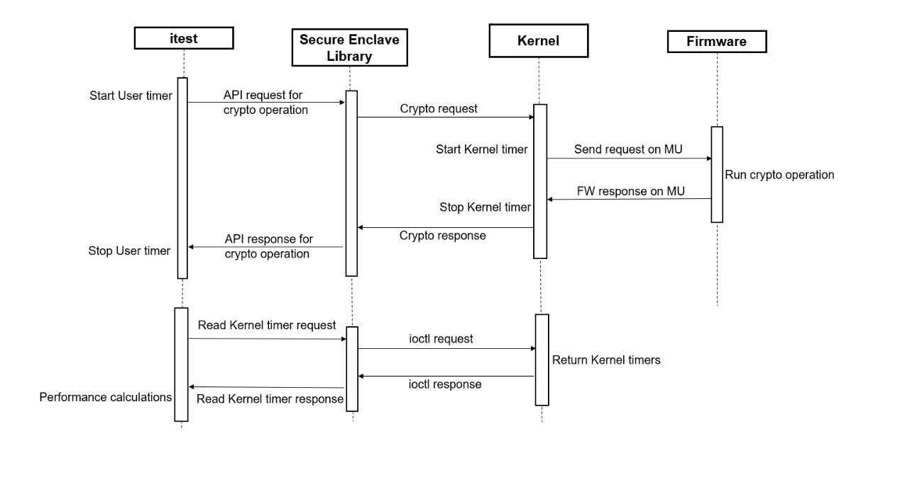

# itest

itest is a performance benchmarking tool to calculate the performance for API(s)
exposed by Secure Enclave Library for:

- HSM
- SHE

These API(s) are consumed and responded by the ELE and V2X.

|      TEST APP           | SE Library   |
| :---------------------: | ------------ |
|       itest             | ELE_HSM      |
|    itest_v2x_hsm        | V2X_HSM      |
|     itest_v2x           | V2X_SHE      |

# Working



Supported Arch: x86_64, arm64

Supported OS: Linux

Dependency: Openssl, Secure_enclave

-------------------------------------------------------------------------------

# 1. Setup

## 1-1. Install the toolchain
```
$ ./b -s toolchain -T <PATH WHERE TO INSTALL>
```
## 1-2. Setup the toolchain
```
$ <TOOLCHAIN PATH>/gcc-linaro-7.5.0-2019.12-x86_64_aarch64-linux-gnu/setup_linaro_aarch64.sh
```
-------------

# 2. Build
For the build, it is required to build openssl and secure_enclave

## 2-1. Build script
```
 $ ./b [options]
options:
$ -h: print this help
$ -H <ARCH>: select the arch (arm64 or x86_64)
$ -S <path>: path to secure_enclave
$ -f: force rebuild static lib openssl, secure_enclave
$ -T <Toolchain path>: toolchain path (where will be installed the toolchain)
```

## 2-2. Build for arm64
```
$ ./b -H arm64 -f
```
-------------

# 3. Run itest application

## 3-1. List all tests for a platform
```
$ ./itest -l
```

## 3-2. Run a test
```
$ ./itest -t <test name>
```
